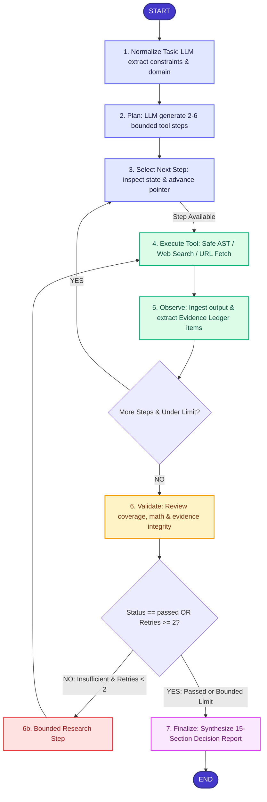

# ArchPilot: Evidence-Driven AI Engineering Decision Agent

[](https://www.python.org/downloads/)
[](https://fastapi.tiangolo.com)
[](https://github.com/langchain-ai/langgraph)
[](LICENSE)
[](tests/)

> Built for the **Techvruk AI Agentic System Challenge**. ArchPilot transforms complex engineering design tasks into verifiable, deterministic architectural decisions backed by documented evidence, published benchmarks, and AST-verified calculations and capacity models.

---

## 1. Problem Statement & Why ArchPilot Exists

Software and systems architecture decisions are high-stakes. When engineering teams rely on standard Large Language Models (LLMs) for system sizing, infrastructure selection, or capacity planning, they encounter critical failure modes:
- **Hallucinated Capacity Metrics**: Single-prompt LLMs generate plausibly sounding but mathematically incorrect RAM, throughput, and disk sizing figures.
- **Unverified Claims**: Standard LLMs cite non-existent benchmarks or confuse theoretical estimates with empirical reality.
- **Dangling Assumptions**: Decisions lack traceability back to actual operational constraints or verified technical documentation.
- **Absence of Verification Gates**: Single-turn LLMs cannot test their own conclusions against constraints, retry research when evidence is missing, or audit decision validity.

**Why ArchPilot Exists**:  
ArchPilot replaces single-prompt LLM generation with a **genuine, cyclic agentic state machine** powered by **LangGraph**. It enforces a strict engineering loop:

$$\text{PLAN} \longrightarrow \text{ACT} \longrightarrow \text{OBSERVE} \longrightarrow \text{VALIDATE} \longrightarrow \text{RESPOND}$$

ArchPilot guarantees that every technical claim is recorded in an **Evidence Ledger**, every sizing number is computed using a **safe AST math evaluator**, every decision is tracked in a **Decision Ledger**, and the complete deliverable passes a formal **Validation Center** quality gate before finalization.

---

## 2. Key Capabilities

1. **Stateful LangGraph Workflow**: Multi-step state machine with cyclical observation feedback and a bounded research loop (capped at 2 retries to eliminate infinite loops).
2. **Evidence Ledger (`EV-xxx`)**: Verifiable evidence ledger preserving canonical URLs, source types (`documentation`, `benchmark`, `web`), verbatim excerpts, relevance, confidence ratings, and verification status.
3. **Decision Ledger (`DEC-xxx`)**: Architectural decisions explicitly linked to existing evidence citations, addressed constraints, explicit assumptions, and accepted trade-offs.
4. **Deterministic Math Engine**: Safe AST-based calculator without `eval()` or `exec()`, enforcing safe operators and preventing CPU exhaustion.
5. **SSRF-Hardened Web Research**: Built-in `web_search` and `url_fetch` tools protected by 10-step SSRF defenses blocking loopback, RFC 1918 private IPs, link-local metadata services (`169.254.169.254`, `100.100.100.200`), zero addresses, and cloud metadata hostnames (`metadata.google.internal`, `instance-data`).
6. **Prompt Injection Defense**: Fetched external content is quarantined in `<UNTRUSTED_EXTERNAL_DATA>` blocks and treated as passive data.
7. **Strict Epistemic Classification**: Rigorously distinguishes **FACT**, **CALCULATION**, **ASSUMPTION**, **ESTIMATE**, **BENCHMARK**, **TRADE-OFF**, and **DECISION**. Theoretical calculations are never represented as empirical benchmarks.
8. **Pluggable LLM Backends**: Seamless support for **Mock mode** (zero keys, offline testing), **Ollama** (local privacy), and **OpenAI-Compatible** endpoints (vLLM, Groq, Together, DeepSeek, OpenAI).
9. **Comprehensive 15-Section Report**: Synthesizes executive summary, problem definition, requirements, assumptions, recommended architecture, 2 viable alternatives, comparison matrix, calculations, evidence ledger, decision ledger, trade-offs, risks, roadmap, and confidence metrics.
10. **Interactive SaaS Dashboard**: Streamlit interface with 8 specialized views: Dashboard, Create Task, Run Workspace, Plan Explorer, Tool Execution, Evidence Ledger, Validation Center, and Decision Report.

---

## 3. Technology Stack

| Component | Technology | Role in ArchPilot |
|---|---|---|
| **Language** | Python 3.11+ (Tested on Python 3.14) | Core implementation language |
| **API Framework** | FastAPI 0.115+ | Async REST API, OpenAPI docs, and background execution |
| **Agent State Machine** | LangGraph 0.2+ | Cyclic graph orchestration, conditional edges, and bounded retry loops |
| **Data Validation** | Pydantic v2 & `pydantic-settings` | Strongly typed state, structured outputs, and environment settings |
| **Database / Persistence** | SQLAlchemy 2.0 (SQLite default) | Relational persistence of runs, steps, tool events, evidence, and decisions (`sqlite:///./archpilot.db` default; PostgreSQL connection supported via `DATABASE_URL`, though production PostgreSQL/Alembic is not pre-configured out-of-the-box) |
| **Mathematical Engine** | Python AST Evaluator | Deterministic arithmetic without `eval()` |
| **Web Research** | `SearchProvider` (`Mock` & `Live`) | Normalized search interface supporting Tavily and SerpApi with fallback |
| **URL Security** | Custom `UrlFetchTool` + `httpx` | SSRF defense, IP address inspection, byte/character caps, HTML sanitizer |
| **Frontend UI** | Streamlit 1.38+ | 8-view systems engineering dashboard with Mermaid diagrams |
| **Testing** | Pytest, `pytest-asyncio`, `anyio` | Comprehensive test suite (**71 tests passing**) |

---

## 4. Agent Architecture & LangGraph Workflow

ArchPilot's execution is governed by a compiled LangGraph `StateGraph`:



### Agentic Workflow Execution Sequence:

```
User Task
    ↓
Normalize (LLM task disambiguation & constraint extraction)
    ↓
Plan (LLM multi-step plan generation with tool assignments)
    ↓
Select Action (State-based step selection & pointer advancement)
    ↓
Tool Execution (Safe AST Calculator, Web Search, URL Fetch)
    ↓
Observe (Ingest output, extract Evidence Ledger items, record telemetry)
    ↓
Validate (Quality gate: audit evidence coverage, constraints, math, integrity)
    ↓
Research / Retry (Bounded retry loop dispatched when evidence is insufficient)
    ↓
Final Decision (Synthesize comprehensive 15-section report with zero dangling citations)
```

### Why ArchPilot is Agentic (vs. a Single LLM Call)

A single LLM prompt cannot reliably solve systems architecture because:
1. **No External Grounding or State**: A single prompt cannot maintain state, execute external tools, observe results, and dynamically adjust its execution path.
2. **Arithmetic Hallucination**: LLMs are autoregressive token predictors and frequently hallucinate capacity, RAM, and bandwidth calculations. ArchPilot routes all math through a safe AST evaluator.
3. **No Self-Correction or Validation Gate**: A one-shot prompt produces an answer with no verification. ArchPilot's `validate` node audits the accumulated evidence and state against user constraints, and can loop back to research if gaps exist.
4. **Epistemic Traceability**: Every decision in ArchPilot is linked to verified Evidence Ledger items (`EV-xxx`) with canonical URLs and excerpts. Dangling references are detected and removed—no evidence is ever fabricated.

---

## 5. Tools

| Tool | Input Schema | Safety Controls & Guardrails |
|---|---|---|
| `calculator` | `expression: str` | Evaluates via Python AST parsing. Rejects `eval()`, `exec()`, imports, variables, and loops. Enforces power exponent ceilings (exponent $\le 100$) to prevent CPU denial-of-service. Supports `abs`, `round`, `min`, `max`, `ceil`, `floor`, `sqrt`, `log`, `exp`. |
| `web_search` | `query: str, max_results: int` | Dispatches through `SearchProvider`. In mock mode, queries deterministic local knowledge base. In live mode, uses Tavily or SerpApi with automatic fallback to mock on network or credential failure. |
| `url_fetch` | `url: str` | Strict 10-step SSRF defense: enforces HTTP/HTTPS, rejects localhost, loopback, private ranges, link-local metadata (`169.254.169.254`, `100.100.100.200`), zero addresses, and cloud metadata hostnames (`metadata.google.internal`). Re-validates every redirect hop. Caps downloads at 500 KB and sanitizes HTML text to 3,000 characters. |

---

## 6. Evidence & Validation Architecture

### 6.1 Epistemic Classifications
ArchPilot strictly distinguishes knowledge categories:
- **FACT**: Documented empirical or verified finding with an actual Evidence Ledger citation (e.g. `[EV-001]`).
- **CALCULATION**: Deterministic arithmetic output computed from verified mathematical expressions.
- **ASSUMPTION**: Explicit technical baseline hypothesis or unverified parameter (e.g. 25 chunks/doc, 2 queries/min).
- **ESTIMATE**: Approximations derived from pricing assumptions, sizing heuristics, metadata overhead, or capacity models.
- **BENCHMARK**: Empirical measurements from executed load tests, profiling, or published vendor documentation. Theoretical calculations are never described as empirical benchmarks.
- **DECISION**: Formal architectural choice linking evidence, calculations, and trade-offs to a decision identifier (e.g. `[DEC-001]`).
- **TRADE-OFF**: Inevitable compromise between competing architectural priorities.

### 6.2 Evidence Integrity Check
Before finalization, `EvidenceService.check_evidence_integrity()` verifies that every `supporting_evidence_id` in each `DecisionItem` exists in the actual Evidence Ledger. Non-existent IDs are flagged as dangling references and dropped—**no evidence is ever fabricated**.

---

## 7. Security Architecture

1. **Input Validation**: `validate_task_input` enforces a 4,000-character ceiling and blocks command injection patterns (`__import__`, `subprocess`, `os.system`, shell wrappers).
2. **Tool Allowlist**: `verify_tool_allowed` restricts tool calls to `['calculator', 'web_search', 'url_fetch']`. Unknown tools are immediately rejected.
3. **SSRF Defense-in-Depth**:
   - Scheme: HTTP / HTTPS only.
   - Hostname: Blocks `localhost`, `*.localhost`, `metadata.google.internal`, `metadata`, `instance-data`, `*.internal`, `*.local`.
   - IP Address: DNS resolved; blocks `127.0.0.0/8`, `10.0.0.0/8`, `172.16.0.0/12`, `192.168.0.0/16`, `169.254.0.0/16`, `100.64.0.0/10`, `100.100.100.200`, `0.0.0.0`, `::`.
   - Redirects: Every redirect hop is independently revalidated against SSRF policies.
   - Byte ceiling: Maximum 500 KB per response.
4. **Prompt Injection Quarantine**: Fetched external content is wrapped in `<UNTRUSTED_EXTERNAL_DATA>` tags. System prompts instruct the LLM to treat content strictly as passive data.

---

## 8. Installation & Environment Configuration

### 8.1 Installation

```bash
# Clone the repository
git clone https://github.com/kavita1722-sys/archpilot.git
cd archpilot

# Create and activate virtual environment
python -m venv .venv

# On Linux/macOS:
source .venv/bin/activate

# On Windows PowerShell:
.\.venv\Scripts\Activate.ps1

# Install in editable mode with development dependencies
pip install -e ".[dev]"
```

### 8.2 Environment Configuration

Copy the example environment file:
```bash
cp .env.example .env
```

---

## 9. LLM Provider Configurations

ArchPilot supports three interchangeable LLM provider modes configured via `.env` without modifying application code or architecture.

### Mode A: Mock Mode (Default — Zero Cost, Offline Demos & Testing)
Requires **no API keys, no internet connection, and zero paid accounts**:
```env
LLM_PROVIDER="mock"
DATABASE_URL="sqlite:///./archpilot.db"
```
*Note*: Mock mode generates deterministic fixtures and capacity models for fast, reliable testing. Mock outputs are explicitly labeled as `DEMO / MOCK OUTPUT`.

### Mode B: Ollama Mode (Local Open-Source LLMs)
Runs completely locally on your hardware with open-source models:
```env
LLM_PROVIDER="ollama"
OLLAMA_BASE_URL="http://localhost:11434"
OLLAMA_MODEL="llama3.2:latest"
DATABASE_URL="sqlite:///./archpilot.db"
```
**Setup Steps**:
1. Install Ollama from [ollama.com](https://ollama.com).
2. Pull a structured-output-capable model:
   ```bash
   ollama pull llama3.2:latest
   ```
3. Start Ollama (`ollama serve`).
4. Set `LLM_PROVIDER="ollama"` in `.env`.

### Mode C: OpenAI-Compatible Mode
Connects to OpenAI, Groq, Together AI, vLLM, LM Studio, or any OpenAI-compatible endpoint:
```env
LLM_PROVIDER="openai_compatible"
OPENAI_API_KEY="your-api-key-here"
OPENAI_BASE_URL="https://api.openai.com/v1"
OPENAI_MODEL="gpt-4o-mini"
DATABASE_URL="sqlite:///./archpilot.db"
```
*For local vLLM / LM Studio / LocalAI*:
```env
LLM_PROVIDER="openai_compatible"
OPENAI_API_KEY="not-needed"
OPENAI_BASE_URL="http://localhost:8000/v1"
OPENAI_MODEL="meta-llama/Llama-3.1-8B-Instruct"
```

## LLM Provider Disclosure

ArchPilot supports multiple provider modes through its LLM abstraction, including local Ollama and OpenAI-compatible providers.

The demonstrated live LLM execution was performed locally using Ollama with Qwen 2.5:7B. No paid API is required for the demonstrated live execution.

For deterministic testing and Docker Compose startup, the default configuration uses the Mock LLM provider. The Docker health/readiness check may therefore report `llm_provider: mock`.

---

## 10. Running the Application

### 10.1 Start the FastAPI Backend
```bash
uvicorn app.main:app --host 127.0.0.1 --port 8000 --reload
```
Interactive API documentation is available at:
- **Swagger UI**: [http://127.0.0.1:8000/docs](http://127.0.0.1:8000/docs)
- **ReDoc**: [http://127.0.0.1:8000/redoc](http://127.0.0.1:8000/redoc)

### 10.2 Launch the Streamlit SaaS Dashboard
In a separate terminal:
```bash
streamlit run ui/streamlit_app.py --server.port 8501
```
Open **[http://localhost:8501](http://localhost:8501)** in your browser.

### 10.3 Run with Docker Compose
```bash
docker compose up --build
```
- Backend: [http://localhost:8000](http://localhost:8000)
- Streamlit UI: [http://localhost:8501](http://localhost:8501)

---

## 11. API Reference

| Method | Endpoint | Description |
|---|---|---|
| `POST` | `/api/v1/runs` | Submit new engineering task (`?sync=true` for synchronous execution) |
| `GET` | `/api/v1/runs/{run_id}` | Get run state, normalized task, plan, and status |
| `GET` | `/api/v1/runs/{run_id}/events` | Chronological audit trail of milestone events |
| `GET` | `/api/v1/runs/{run_id}/tools` | Tool execution telemetry (inputs, outputs, duration) |
| `GET` | `/api/v1/runs/{run_id}/evidence` | Stored items in the Evidence Ledger (`EV-xxx`) |
| `GET` | `/api/v1/runs/{run_id}/decisions` | Structured architectural decisions (`DEC-xxx`) |
| `GET` | `/api/v1/runs/{run_id}/result` | Final synthesized 15-section engineering decision report |
| `GET` | `/api/v1/runs` | List recent engineering runs |
| `GET` | `/api/v1/metrics` | Aggregate dashboard KPIs (Total runs, completed, tool calls, evidence) |
| `GET` | `/health/live` | Liveness health check |
| `GET` | `/health/ready` | Readiness check verifying DB, LLM provider, and tool registry |

---

## 12. Testing & Verification

ArchPilot maintains a comprehensive automated test suite of **71 passing tests** covering every layer of the architecture:

```bash
pytest -v
```

### Exact Current Test Breakdown (71 Tests):

```
tests/test_api.py .................. 6 passed  (API lifecycle, health, validation)
tests/test_calculator.py ........... 7 passed  (Safe AST arithmetic, precedence, functions)
tests/test_calculator_invalid.py ... 7 passed  (Rejection of eval, exec, code injection)
tests/test_db_persistence_phase2.py  3 passed  (Evidence/Decision relational storage)
tests/test_decision_model.py ....... 4 passed  (Decision schemas, dangling reference checks)
tests/test_e2e_canonical_rag.py .... 2 passed  (End-to-end RAG architecture run)
tests/test_evidence_extraction.py .. 3 passed  (Evidence normalization from search/fetch)
tests/test_evidence_filter.py ...... 3 passed  (Supporting / contradicting / insufficient filter)
tests/test_final_report_schema.py .. 1 passed  (15-section report schema validation)
tests/test_graph_execution.py ...... 1 passed  (LangGraph execution flow)
tests/test_mock_llm.py ............. 5 passed  (Mock LLM outputs, factory instantiation)
tests/test_schemas.py .............. 6 passed  (Plan, Task, Tool, State models)
tests/test_search_provider.py ...... 3 passed  (Mock and Live search provider fallback)
tests/test_state_transitions.py .... 4 passed  (LangGraph conditional edges & policies)
tests/test_tool_registry.py ........ 5 passed  (Tool allowlist, execution, rejection)
tests/test_url_security_ssrf.py .... 8 passed  (SSRF defenses, metadata blocking)
tests/test_validation_routing.py ... 3 passed  (Validation Center & bounded research retries)

============================= 71 passed in 4.26s =============================
```

Bytecode compilation verification:
```bash
python -m compileall -q app tests ui
```

---

## 13. Canonical Contest Demonstration: Sample Input, Output & Demo Guide

Complete contest artifacts are located in `docs/demo/`:

- **Sample Input**: [`docs/demo/sample_input.md`](docs/demo/sample_input.md)  
  *Canonical Task*: "Design an architecture for a private RAG platform that must ingest 100,000 PDF documents, support 20 concurrent users, maintain strict data privacy, and stay within a constrained infrastructure budget. Compare architecture alternatives, calculate capacity requirements, identify risks, and provide an implementation roadmap."
- **Sample Output**: [`docs/demo/sample_output.md`](docs/demo/sample_output.md)  
  *Complete Report*: Includes normalized task, 5-step plan, tool execution telemetry, observations, capacity calculations, Evidence Ledger (`EV-001` through `EV-004`), Validation Center audit, Decision Ledger (`DEC-001`, `DEC-002`), recommended architecture, 2 alternative architectures, comparison matrix, trade-offs, and implementation roadmap. (Explicitly labeled `DEMO / MOCK OUTPUT`).
- **5-Minute Demonstration Video Script**: [`docs/demo/DEMO_SCRIPT.md`](docs/demo/DEMO_SCRIPT.md)  
  A structured 4-minute 50-second screen-recording script guiding an evaluator through problem introduction, task creation, plan exploration, tool execution, observations, validation audit, decision synthesis, and architecture breakdown.
- **5-Slide Contest Presentation**: [`docs/demo/PRESENTATION.md`](docs/demo/PRESENTATION.md)  
  Concise 5-slide presentation covering Problem & Motivation, ArchPilot Solution, Agentic Architecture, Demo & Validation, and Security & Results.

### Step-by-Step UI Demo Walkthrough:
1. Start the backend: `uvicorn app.main:app --port 8000`
2. Start Streamlit UI: `streamlit run ui/streamlit_app.py --server.port 8501`
3. Navigate to **Create Task** in the sidebar.
4. Select the **Canonical RAG Platform** preset (or copy from [`docs/demo/sample_input.md`](docs/demo/sample_input.md)).
5. Click **Start Engineering Run**.
6. Follow the live timeline: `Normalize` → `Plan` → `Tool Execution` → `Observe` → `Validate` → `Finalize`.
7. Inspect the **Plan Explorer**, **Tool Execution** telemetry, **Evidence Ledger**, **Validation Center**, and **Decision Report** tabs.

---

## 14. Known Limitations & Mock-Mode Boundary

### 14.1 Known Limitations
- **SQLite Concurrency**: By default, ArchPilot uses SQLite (`archpilot.db`) with Write-Ahead Logging (WAL) for simplicity and zero-configuration setups. Production high-concurrency environments should connect to PostgreSQL via `DATABASE_URL` (production PostgreSQL/Alembic migrations are not pre-configured out-of-the-box).
- **Single-Node Execution**: ArchPilot runs locally or within a single container. Distributed multi-worker job queues (e.g. Celery/Temporal) are outside current project scope.
- **Search API Dependency**: Live search requires active API keys (`TAVILY_API_KEY` or `SERPAPI_API_KEY`). If unset or network is unavailable, ArchPilot gracefully falls back to `MockSearchProvider`.

### 14.2 Mock-Mode Limitations
- In `LLM_PROVIDER=mock`, technical benchmarks and documentation excerpts are offline reference fixtures, not live internet scrapes.
- Sizing figures (e.g. 14.31 GB vector RAM, ~$410/month cloud spend, 2.0 peak QPS) represent deterministic mathematical capacity modeling and stated AWS pricing assumptions, **not executed live empirical load tests or actual cloud invoices**.

---

## 15. Repository Structure

```
archpilot/
├── .env.example              # Environment variables template
├── .gitignore                # Git ignore rules (.env, .db, caches ignored)
├── .dockerignore             # Docker build ignore rules
├── Dockerfile                # Multi-service container image definition
├── compose.yaml              # Docker Compose for Backend + Streamlit UI
├── pyproject.toml            # Project metadata and dependencies (MIT License)
├── LICENSE                   # Standard MIT License
├── README.md                 # Complete system documentation
├── app/
│   ├── main.py               # FastAPI application entrypoint
│   ├── agent/
│   │   ├── graph.py          # LangGraph StateGraph assembly
│   │   ├── nodes.py          # Node execution functions
│   │   ├── policies.py       # Bounded execution limits and guardrails
│   │   ├── prompts.py        # System prompts and prompt injection defenses
│   │   └── state.py          # TypedDict AgentState definition
│   ├── api/
│   │   ├── router.py         # Main API router
│   │   └── routes/           # REST endpoints (runs, health, metrics)
│   ├── core/
│   │   ├── config.py         # Pydantic BaseSettings
│   │   ├── errors.py         # Structured error hierarchy
│   │   ├── logging.py        # Structured logging configuration
│   │   └── security.py       # Input validation & tool allowlist
│   ├── db/
│   │   ├── database.py       # SQLAlchemy engine & session factory
│   │   ├── models.py         # Relational database models
│   │   └── repository.py     # Database CRUD repository
│   ├── llm/
│   │   ├── base.py           # LLMProvider abstract base class
│   │   ├── factory.py        # Provider factory (mock, ollama, openai_compatible)
│   │   ├── mock.py           # Deterministic MockLLMProvider
│   │   ├── ollama.py         # OllamaProvider (local REST)
│   │   └── openai_provider.py# OpenAICompatibleProvider
│   ├── schemas/              # Pydantic data models (task, plan, tool, evidence, decision, result)
│   ├── services/
│   │   ├── run_service.py    # Orchestration service bridging API & LangGraph
│   │   └── evidence_service.py # Evidence extraction & integrity checks
│   └── tools/
│       ├── base.py           # BaseTool abstract class
│       ├── calculator.py     # AST-based safe math tool
│       ├── registry.py       # Central ToolRegistry
│       ├── search_provider.py# Mock and Live search providers
│       ├── url_fetch.py      # SSRF-hardened URL fetch tool
│       └── web_search.py     # Registered web search tool
├── docs/
│   ├── ARCHITECTURE.md       # Technical architecture specification
│   └── demo/
│       ├── DEMO_SCRIPT.md    # 5-minute video demonstration recording script
│       ├── PRESENTATION.md   # 5-slide contest presentation outline
│       ├── sample_input.md   # Canonical contest sample input
│       └── sample_output.md  # Canonical contest sample output report
├── tests/                    # 71 comprehensive automated tests
└── ui/
    └── streamlit_app.py      # 8-view Streamlit SaaS engineering dashboard
```

---

## 16. TechVruk AI Agentic System Challenge Deliverables

| Requirement | Implementation in ArchPilot | Status |
|---|---|---|
| **Text Task Input** | `POST /api/v1/runs` and Streamlit **Create Task** view | **PASS** |
| **Multi-Step Plan** | `plan` node generates 2-6 structured steps with assigned tools | **PASS** |
| **LLM Reasoning** | `normalize_task`, `plan`, `validate`, `finalize` powered by LLM provider | **PASS** |
| **Tool Execution** | `execute_tool` executes `calculator`, `web_search`, `url_fetch` | **PASS** |
| **State Persistence** | `AgentState` maintained across all nodes and stored in SQLite | **PASS** |
| **Observation Feedback**| `observe` node ingests tool results and populates Evidence Ledger | **PASS** |
| **Validation Gate** | `validate` node audits evidence coverage, math, and constraint fulfillment | **PASS** |
| **Bounded Retry Loop** | `research_step` retries missing research up to max 2 attempts | **PASS** |
| **15-Section Final Result** | `finalize` node synthesizes full 15-section report | **PASS** |
| **Real LLM Integration** | Pluggable `ollama` and `openai_compatible` providers alongside `mock` | **PASS** |
| **Safe Math (No eval)** | Python AST parsing with operator allowlists and exponent caps | **PASS** |
| **SSRF Security** | IP resolution inspection, loopback/private/cloud metadata blocking | **PASS** |
| **Prompt Injection Guard** | `<UNTRUSTED_EXTERNAL_DATA>` prompt quarantine | **PASS** |
| **71 Passing Tests** | `pytest -v` verified with zero failures | **PASS** |

---

## 17. License

ArchPilot is licensed under the MIT License. See [LICENSE](LICENSE) for details.
