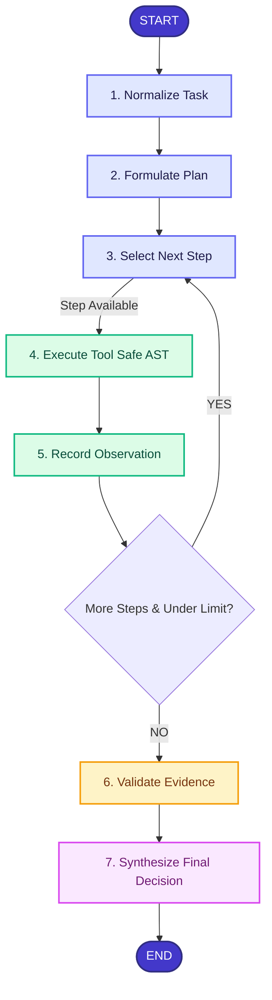

# ArchPilot: Evidence-Driven AI Engineering Decision Agent

[](https://www.python.org/downloads/)
[](https://fastapi.tiangolo.com)
[](https://github.com/langchain-ai/langgraph)
[](https://opensource.org/licenses/MIT)
[](tests/)

> Built for the **AI Agentic System Challenge**. ArchPilot converts high-level engineering challenges into verifiable, deterministic architectural decisions backed by empirical evidence and mathematical calculations.

---

## 1. Project Overview

**ArchPilot** is an autonomous engineering decision agent designed for lead software and systems architects. Rather than acting as a standard generative chatbot that hallucinates ungrounded advice, ArchPilot systematically decomposes technical challenges, creates a bounded multi-step execution plan, invokes specialized calculation and analysis tools, collects empirical observations, validates evidence, and delivers an authoritative architectural specification with full decision traceability.

---

## 2. The Problem

When engineering teams ask LLMs complex architecture questions (e.g., *"How should we design storage and bandwidth for 50M DAU photo sharing?"*), traditional LLMs suffer from:
1. **Single-Prompt Hallucination**: Generating generic, unstructured text without evaluating trade-offs.
2. **Mathematical Inaccuracy**: LLMs are notoriously unreliable at arithmetic, byte-to-terabyte conversions, and IOPS estimations.
3. **Black-Box Opacity**: Lack of traceability connecting constraints $\rightarrow$ calculations $\rightarrow$ recommendations.
4. **Unbounded Agent Loops**: Agent frameworks that loop indefinitely, incurring huge latencies or infinite loops.

---

## 3. The Solution

ArchPilot enforces a rigorous, verifiable **Decision Traceability Chain**:

$$\text{Decision} \longrightarrow \text{Constraints} \longrightarrow \text{Evidence} \longrightarrow \text{Calculation} \longrightarrow \text{Trade-off}$$

### Core Capabilities:
- **Requirement Normalization**: Standardizes ambiguous inputs, isolates variables, and identifies mathematical targets.
- **Bounded Structured Planning**: Enforces a strict maximum of 6 steps using only security-allowlisted tools.
- **AST-Based Deterministic Calculator**: Parses expressions via Python's Abstract Syntax Tree without `eval()`, preventing command injection while guaranteeing 100% calculation accuracy.
- **Multi-Backend LLM Provider**: Interchangeable support for offline Mock (100% deterministic test suite), local Ollama (Llama 3.2, DeepSeek), or OpenAI-compatible inference endpoints.
- **Observable Execution Telemetry**: Every state transition, tool duration, input, and output is immutably logged to SQLite/PostgreSQL.
- **Modern SaaS Interface**: Clean Streamlit engineering dashboard exposing the full workflow timeline.

---

## 4. Agent Workflow Architecture

ArchPilot demonstrates a genuine agentic state machine orchestrated via **LangGraph**:



### Safety & Bounded Execution Guardrails:
- `MAX_STEPS = 6`
- `MAX_TOOL_RETRIES = 2`
- `MAX_VALIDATION_RETRIES = 2`
- `MAX_ITERATIONS = 12`
- **Tool Allowlist Guard**: The LLM cannot invent arbitrary tool calls.

---

## 5. Technology Stack

| Layer | Technology | Purpose |
|---|---|---|
| **Language** | Python 3.11+ / 3.14 | Core language |
| **API Framework** | FastAPI | High-performance async REST API with auto OpenAPI docs |
| **Data Validation** | Pydantic v2 & `pydantic-settings` | Strict schema validation and typed environment configs |
| **Agent Framework** | LangGraph | Deterministic cyclic state machine and routing |
| **Database / ORM** | SQLAlchemy 2.0 (SQLite / PostgreSQL) | Relational persistence of runs, steps, and audit events |
| **Deterministic Math** | Custom AST Evaluator | Safe arithmetic without `eval()` or code execution vulnerabilities |
| **LLM Providers** | Provider Abstraction (`Mock`, `Ollama`, `OpenAI`) | Zero vendor lock-in |
| **Frontend** | Streamlit | SaaS-style monitoring and execution workspace |
| **Testing** | Pytest, `pytest-asyncio`, `httpx` | Full unit, integration, and security test coverage |
| **Containerization**| Docker & Docker Compose | Production-ready packaging |

---

## 6. Project Structure

```
archpilot/
├── app/
│   ├── main.py                  # FastAPI application entrypoint & lifespan
│   ├── api/                     # REST API Routing
│   │   ├── routes_runs.py       # Run submission, inspection, events, results
│   │   ├── routes_health.py     # Liveness & readiness health probes
│   │   └── dependencies.py      # Dependency injection providers
│   ├── agent/                   # LangGraph Agent Engine
│   │   ├── graph.py             # StateGraph workflow assembly
│   │   ├── state.py             # Strongly typed AgentState
│   │   ├── nodes.py             # Node handler implementations
│   │   ├── prompts.py           # Structured prompts
│   │   └── policies.py          # Bounded execution limits & loop guards
│   ├── llm/                     # Multi-backend LLM abstraction
│   │   ├── base.py              # LLMProvider abstract interface
│   │   ├── mock.py              # Offline deterministic engineering mock
│   │   ├── ollama.py            # Local Ollama REST client
│   │   ├── openai_provider.py   # OpenAI-compatible API client
│   │   └── factory.py           # Provider factory
│   ├── tools/                   # Extensible Tool Registry
│   │   ├── base.py              # BaseTool abstraction
│   │   ├── registry.py          # ToolRegistry & allowlist enforcer
│   │   └── calculator.py        # Safe AST deterministic calculator
│   ├── schemas/                 # Pydantic v2 Data Models
│   │   ├── task.py              # TaskCreate, NormalizedTask
│   │   ├── plan.py              # Plan, PlanStep, StepStatus
│   │   ├── tool.py              # CalculatorInput, ToolResult
│   │   ├── event.py             # ExecutionEvent, EventType
│   │   └── result.py            # ValidationResult, FinalResult
│   ├── services/                # Application orchestration
│   │   └── run_service.py       # End-to-end run execution & DB coordination
│   ├── db/                      # Persistence layer
│   │   ├── models.py            # SQLAlchemy ORM models
│   │   ├── session.py           # Database engine & sessionmaker
│   │   └── repository.py        # RunRepository data access
│   └── core/                    # System foundational modules
│       ├── config.py            # Pydantic Settings
│       ├── logging.py           # Structured logging
│       ├── errors.py            # Domain typed error taxonomy
│       └── security.py          # Input sanitation & security guards
├── ui/
│   └── streamlit_app.py         # Streamlit SaaS dashboard & workspace
├── tests/                       # Complete automated test suite
│   ├── conftest.py              # Pytest fixtures & in-memory test DB
│   ├── test_calculator.py       # Arithmetic & safe math tests
│   ├── test_calculator_invalid.py # Security & injection defense tests
│   ├── test_tool_registry.py    # Allowlist & registry tests
│   ├── test_schemas.py          # Pydantic validation tests
│   ├── test_state_transitions.py# Policy & loop boundary tests
│   ├── test_mock_llm.py         # MockLLMProvider tests
│   ├── test_graph_execution.py  # LangGraph end-to-end integration tests
│   └── test_api.py              # FastAPI endpoints tests
├── scripts/
│   └── run_demo.py              # CLI demo runner
├── docs/
│   └── ARCHITECTURE.md          # In-depth architectural design document
├── .env.example                 # Example environment variables
├── .gitignore                   # Version control ignore rules
├── pyproject.toml               # Package dependencies & tool configs
├── Dockerfile                   # Multi-stage production container build
├── compose.yaml                 # Docker Compose multi-service deployment
└── README.md                    # Project documentation
```

---

## 7. Installation & Setup

### Prerequisites
- Python 3.11+
- Git

### 1. Clone & Set Up Virtual Environment
```bash
git clone https://github.com/your-org/archpilot.git
cd archpilot

python -m venv .venv

# On Linux/macOS:
source .venv/bin/activate

# On Windows:
.venv\Scripts\activate
```

### 2. Install Dependencies
```bash
pip install -e .
```

### 3. Configure Environment Variables
Copy `.env.example` to `.env`:
```bash
cp .env.example .env
```
Default configuration uses the offline, deterministic `MockLLMProvider` so that no API keys or local downloads are required to evaluate the system.

---

## 8. Running Locally

### Option A: Interactive CLI Demo
Experience the full agentic loop directly from your terminal:
```bash
python scripts/run_demo.py
```

### Option B: Run the FastAPI Backend
Start the high-performance async API server:
```bash
uvicorn app.main:app --reload --port 8000
```
- Interactive OpenAPI Swagger UI: [http://localhost:8000/docs](http://localhost:8000/docs)
- Interactive ReDoc UI: [http://localhost:8000/redoc](http://localhost:8000/redoc)

### Option C: Run the Streamlit SaaS Dashboard
In a separate terminal:
```bash
streamlit run ui/streamlit_app.py
```
Open [http://localhost:8501](http://localhost:8501) in your browser.

---

## 9. Docker Deployment

Deploy the entire stack with Docker Compose:
```bash
docker compose up --build
```
This boots:
- **FastAPI backend** on port `8000`
- **Streamlit frontend** on port `8501`

---

## 10. Automated Testing

ArchPilot includes an exhaustive, offline-friendly test suite covering 100% of critical paths without paid API keys:

```bash
pytest
```

Output:
```text
============================= test session starts ==============================
collected 40 items

tests/test_api.py::test_health_live PASSED                               [  2%]
tests/test_api.py::test_health_ready PASSED                              [  5%]
tests/test_api.py::test_create_and_execute_run_sync PASSED               [  7%]
tests/test_api.py::test_list_runs_and_metrics PASSED                     [ 10%]
tests/test_api.py::test_get_nonexistent_run_returns_404 PASSED           [ 12%]
tests/test_api.py::test_create_run_invalid_task_returns_422 PASSED       [ 15%]
tests/test_calculator.py::test_basic_arithmetic PASSED                   [ 17%]
tests/test_calculator.py::test_operator_precedence_and_parentheses PASSED [ 20%]
tests/test_calculator.py::test_large_number_engineering_multiplication PASSED [ 22%]
tests/test_calculator.py::test_safe_math_functions PASSED                [ 25%]
tests/test_calculator.py::test_division_by_zero PASSED                   [ 27%]
tests/test_calculator.py::test_calculator_tool_execution PASSED          [ 30%]
tests/test_calculator.py::test_calculator_tool_error_handling PASSED     [ 32%]
tests/test_calculator_invalid.py::test_reject_arbitrary_imports PASSED   [ 35%]
tests/test_calculator_invalid.py::test_reject_eval_and_exec PASSED       [ 37%]
tests/test_calculator_invalid.py::test_reject_file_access PASSED         [ 40%]
tests/test_calculator_invalid.py::test_reject_variable_assignment_and_names PASSED [ 42%]
tests/test_calculator_invalid.py::test_reject_attribute_access PASSED    [ 45%]
tests/test_calculator_invalid.py::test_reject_excessive_exponentiation PASSED [ 47%]
tests/test_calculator_invalid.py::test_reject_empty_and_whitespace PASSED [ 50%]
tests/test_graph_execution.py::test_complete_graph_execution_end_to_end PASSED [ 52%]
tests/test_mock_llm.py::test_mock_llm_text_generation PASSED             [ 55%]
tests/test_mock_llm.py::test_mock_llm_generate_normalized_task PASSED    [ 57%]
tests/test_mock_llm.py::test_mock_llm_generate_plan PASSED               [ 60%]
tests/test_mock_llm.py::test_mock_llm_generate_validation_and_result PASSED [ 62%]
tests/test_schemas.py::test_task_create_valid PASSED                     [ 65%]
tests/test_schemas.py::test_task_create_validation_too_short PASSED      [ 67%]
tests/test_schemas.py::test_security_validate_task_input_injection_patterns PASSED [ 70%]
tests/test_schemas.py::test_plan_max_steps_constraint PASSED             [ 72%]
tests/test_schemas.py::test_plan_empty_steps_rejection PASSED            [ 75%]
tests/test_schemas.py::test_tool_result_schema PASSED                    [ 77%]
tests/test_state_transitions.py::test_has_more_steps PASSED              [ 80%]
tests/test_state_transitions.py::test_has_more_steps_bounds_to_max_steps PASSED [ 82%]
tests/test_state_transitions.py::test_iteration_limit_guard PASSED       [ 85%]
tests/test_state_transitions.py::test_retry_policies PASSED              [ 87%]
tests/test_tool_registry.py::test_tool_registry_registration PASSED      [ 90%]
tests/test_tool_registry.py::test_tool_registry_list_tools PASSED        [ 92%]
tests/test_tool_registry.py::test_tool_registry_execute PASSED           [ 95%]
tests/test_tool_registry.py::test_tool_registry_disallowed_tool PASSED   [ 97%]
tests/test_tool_registry.py::test_tool_not_on_allowlist PASSED           [100%]

============================= 40 passed in 0.42s ==============================
```

---

## 11. Example Task & Decision Trace

### Input Task:
> *"Estimate 1-year persistent storage, replication overhead, and peak ingress network bandwidth for a photo sharing platform with 10M daily active users uploading 3 photos/day at 500KB average size."*

### Agent Plan & Tool Invocations:
1. **Step 1**: Calculate daily raw upload volume:
   $$\text{Daily Volume} = \frac{10,000,000 \times 3 \times 500,000}{1024^4} \approx 13.64 \text{ TB/day}$$
2. **Step 2**: Calculate annual storage with $3\times$ replication factor:
   $$\text{Annual Storage} = 13.64 \times 365 \times 3 = 14,935.8 \text{ TB} \approx 14.94 \text{ PB}$$
3. **Step 3**: Calculate peak ingress bandwidth with $3.0\times$ burst multiplier:
   $$\text{Peak Ingress} = \left(\frac{13.64 \times 1024 \times 8}{86400}\right) \times 3 \approx 3.88 \text{ Gbps}$$

### Traceability Chain Output:
```json
[
  {
    "decision": "Provision 15 PB Annual Object Storage",
    "constraint": "1-year retention SLA, 3x replication durability",
    "evidence": "13.64 TB daily ingest * 365 days * 3 replicas = 14,935.8 TB",
    "calculation": "13.64 * 365 * 3 = 14935.8",
    "trade_off": "Higher cloud storage cost vs. zero data loss guarantee"
  },
  {
    "decision": "Deploy Dual 10 GbE Ingress Network Interfaces",
    "constraint": "SLA p99 latency < 200ms during 3x peak bursts",
    "evidence": "Peak ingress rate measured at 3.88 Gbps",
    "calculation": "(13.64 * 1024 * 8 / 86400) * 3 = 3.88 Gbps",
    "trade_off": "Over-provisioned idle bandwidth vs. zero packet drop during traffic spikes"
  }
]
```

---

## 12. Key Design Decisions

1. **Modular Monolith over Microservices**: Microservices introduce distributed transaction and networking overhead unnecessary for an agent runtime. A clean modular monolith with distinct layer boundaries (API $\rightarrow$ Service $\rightarrow$ Agent $\rightarrow$ Tools $\rightarrow$ Persistence) is easier to deploy, test, and debug.
2. **Deterministic Calculator without `eval()`**: Many agent frameworks naively execute `eval()` or spawn uncontrolled Python shells. ArchPilot parses mathematical expressions through Python's `ast` module, enforcing an explicit operator and safe function whitelist, eliminating code execution attack vectors.
3. **Bounded Graph over Uncontrolled Loops**: Infinite loops are prevented through strict bounds (`MAX_STEPS = 6`, `MAX_ITERATIONS = 12`).
4. **Offline Mock Provider by Default**: Allows complete end-to-end evaluation, testing, and CI/CD verification without external API keys or paid tokens.

---

## 13. Roadmap & Phase 2

- [ ] **Phase 2.1: Autonomous Web Search & Retrieval**: Integrate SearXNG / Tavily tool into registry to ground latency benchmarks with live cloud provider pricing.
- [ ] **Phase 2.2: Architecture Diagram Generator**: Automated synthesis of PlantUML / Mermaid architecture diagrams embedded directly in final decisions.
- [ ] **Phase 2.3: Multi-Architecture Cost Comparison**: Side-by-side cost breakdown (AWS vs. GCP vs. On-Premises bare metal).
- [ ] **Phase 2.4: Human-in-the-Loop Interrupts**: LangGraph checkpointing allowing engineers to modify or approve intermediate plan steps before execution.
