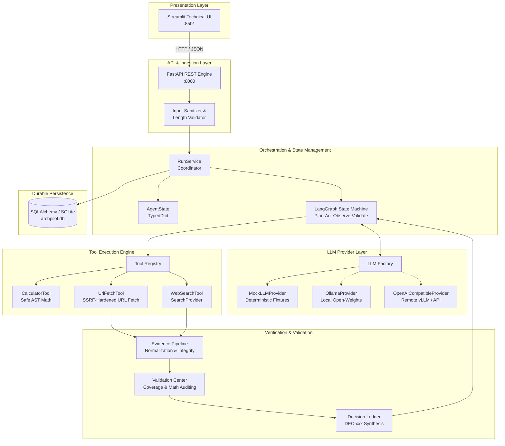

# ArchPilot Architecture & System Design Document — Phase 2

## 1. System Philosophy & Objectives

ArchPilot is an autonomous, evidence-driven AI engineering decision agent. Unlike generative conversational assistants that produce ungrounded or mathematically inconsistent architectural advice, ArchPilot treats system architecture as an empirical, hypothesis-driven workflow:

$$\text{TASK} \longrightarrow \text{PLAN} \longrightarrow \text{RESEARCH} \longrightarrow \text{TOOL EXECUTION} \longrightarrow \text{OBSERVATION} \longrightarrow \text{EVIDENCE} \longrightarrow \text{CALCULATION} \longrightarrow \text{VALIDATION} \longrightarrow \text{DECISION}$$

In **Phase 2**, ArchPilot delivers the **real intelligence layer**:
1. **Evidence Ledger**: Explicit, verifiable external documentation and published benchmark grounding (distinguishing FACT, CALCULATION, ASSUMPTION, ESTIMATE, and published BENCHMARK).
2. **Hardened Web Search & URL Fetch Tools**: Multi-provider search abstraction and multi-layered SSRF protection.
3. **Evidence Pipeline & Filtering**: Evaluates candidate evidence for credibility (`supporting`, `contradicting`, `insufficient`).
4. **Validation Center & Bounded Research Loop**: Multi-dimensional verification with evidence integrity checking and targeted re-search (strictly capped at 2 retries).
5. **Decision Ledger**: First-class architectural decision records linking recommendations directly to verified evidence IDs, constraints, and trade-offs.
6. **15-Section Final Engineering Report**: Distinguishing FACT, CALCULATION, ASSUMPTION, ESTIMATE, BENCHMARK, TRADE-OFF, and DECISION.

---

## 2. Component Taxonomy

### 2.1 API & Presentation Layer
- **FastAPI**: Asynchronous REST endpoints with Pydantic v2 schemas and OpenAPI documentation (`/docs`, `/redoc`):
  - `POST /api/v1/runs`: Task submission (sync or background execution).
  - `GET /api/v1/runs/{run_id}`: Full run status and execution state.
  - `GET /api/v1/runs/{run_id}/events`: Chronological audit event log.
  - `GET /api/v1/runs/{run_id}/tools`: Tool telemetry and execution metrics.
  - `GET /api/v1/runs/{run_id}/evidence`: Stored items in the Evidence Ledger.
  - `GET /api/v1/runs/{run_id}/decisions`: Structured architectural decisions in the Decision Ledger.
  - `GET /api/v1/runs/{run_id}/result`: Synthesized 15-section engineering report.
  - `GET /api/v1/metrics`: High-level system KPIs.
- **Streamlit Engineering UI**: A technical SaaS visual interface with 8 dedicated views:
  1. **Dashboard**: System KPIs and historical runs.
  2. **Create Task**: Problem statement submission with Canonical RAG preset and JSON constraints.
  3. **Run Workspace**: Live status, timeline pills, and execution milestones.
  4. **Plan Explorer**: Visual status cards (`completed`, `running`, `pending`, `failed`).
  5. **Tool Execution**: Granular latency, input/output, and status telemetry.
  6. **Evidence Ledger**: Verified and unverified items, source filters, relevance, and citations.
  7. **Validation Center**: Evidence/constraint/calculation coverage metrics and verification checklist.
  8. **Decision Report**: 15-section report with Mermaid topology diagrams, comparison matrices, and Markdown/JSON export.

### 2.2 Orchestration & Agent State Machine (LangGraph)
- **Cyclic Graph with Bounded Routing**:
  - `normalize_task`: Structures requirements and extracts numerical parameters.
  - `plan`: Formulates a sequenced plan utilizing authorized tools.
  - `select_next_step`: Dispatches next plan step or research query.
  - `execute_tool`: Invokes registered tools (`calculator`, `web_search`, `url_fetch`).
  - `observe`: Formulates empirical observations and extracts evidence.
  - `validate`: Evaluates coverage against constraints and calculation validity.
  - `research_step`: Formulates targeted research queries when validation identifies gaps (max 2 retries).
  - `finalize`: Produces the complete 15-section decision report.
- **AgentState**: Strongly typed state preserving working memory, tool events, observations, calculations, evidence ledger, decision ledger, and iteration counters.

### 2.3 Evidence Ledger & Pipeline
- **EvidenceItem**:
  - `id`: Sequential identifier (`EV-001`, `EV-002`, ...).
  - `title`: Source title or documentation header.
  - `url`: Canonical documentation link.
  - `source_type`: `documentation`, `web`, `benchmark`, `api`, `specification`.
  - `claim`: Specific technical claim supported by the evidence.
  - `excerpt`: Verbatim or summarized relevant text snippet.
  - `relevance`: Semantic relevance score (0.0 to 1.0).
  - `confidence`: Credibility confidence score (0.0 to 1.0).
  - `status`: `verified`, `unverified`, `contradicted`.
- **EvidenceFilter**:
  - Evaluates candidate text against architectural claims.
  - Outputs `supporting`, `contradicting`, or `insufficient` with reasoning.

### 2.4 Decision Ledger
- **DecisionItem**:
  - `id`: Unique decision identifier (`DEC-001`, `DEC-002`, ...).
  - `question`: Core architectural dilemma (e.g. storage architecture, inference tier).
  - `recommendation`: Authoritative, actionable technical specification.
  - `supporting_evidence_ids`: Explicit citations (e.g. `['EV-001', 'EV-004']`).
  - `constraints_addressed`: User constraints satisfied (`privacy`, `scale`, `budget`).
  - `tradeoffs`: Explicit compromises accepted by choosing this recommendation.
  - `assumptions`: Engineering assumptions underpinning the choice.
  - `confidence`: Confidence score (0.0 to 1.0).

### 2.5 Validation Center & Bounded Research Loop
- **Multi-Dimensional Quality Evaluation**:
  - Evidence coverage: Proportion of external claims backed by verified evidence.
  - Constraint coverage: Proportion of user technical constraints addressed.
  - Calculation validity: Deterministic check of formulas and math outputs.
  - Required sections: Verification of all 15 report deliverables.
- **Bounded Research Retry Loop**:
  - If validation returns `status="insufficient"`, missing information is identified.
  - Agent transitions to `research_step`, invokes `web_search` or `url_fetch`, ingests new evidence, and re-validates.
  - Hard constraint: `MAX_VALIDATION_RETRIES = 2`. Infinite loops are mathematically impossible.

### 2.6 Tool Execution Engine & Security
- **CalculatorTool**: Evaluates mathematical formulas via sandboxed Python AST traversal (`ceil`, `floor`, `round`, `sqrt`, `log`, etc.). Zero `eval()` or `exec()`.
- **SearchProvider Abstraction**:
  - `MockSearchProvider`: High-fidelity, deterministic benchmark knowledge for offline execution and testing.
  - `LiveSearchProvider`: Adapter supporting external search APIs (Tavily, SerpApi) via environment variables, with graceful fallback.
- **UrlFetchTool & SSRF Defense-in-Depth**:
  1. URL scheme validation (HTTP/HTTPS only).
  2. Rejection of `localhost`, `*.localhost`.
  3. Rejection of IPv4/IPv6 loopback (`127.0.0.0/8`, `::1`).
  4. Rejection of private IP ranges (RFC 1918: `10.0.0.0/8`, `172.16.0.0/12`, `192.168.0.0/16`).
  5. Rejection of link-local metadata endpoints (`169.254.0.0/16`, AWS/GCP/Azure instance metadata).
  6. Rejection of unspecified addresses (`0.0.0.0`).
  7. Strict request timeout (10 seconds).
  8. Maximum response size cap (500 KB).
  9. Redirect hop re-inspection (revalidating target IPs on every redirect).
  10. Content sanitization (HTML script/style stripping and truncation to 3000 chars).
- **Prompt Injection Defense**:
  - External search results and fetched HTML are strictly treated as UNTRUSTED DATA.
  - Injected into LLM context enclosed within `<UNTRUSTED_EXTERNAL_DATA>` blocks.
  - System instructions explicitly forbid following commands or instructions contained in external text.

### 2.7 Structured Memory Architecture
- **Working Memory**: Dynamic `AgentState` within the active LangGraph execution graph.
- **Durable Run Memory**: SQLite tables by default (`runs`, `steps`, `tool_events`, `execution_events`, `final_reports`) with PostgreSQL connection support via `DATABASE_URL`.
- **Evidence Memory**: Relational tables (`evidence`, `decisions`) maintaining empirical grounding across all runs.
- **Privacy Principle**: Zero hidden chain-of-thought is persisted. Only structured actions, observations, evidence, decisions, and calculations are audited.

---

## 3. Data Flow Diagram

```
User Task Submission (API / Streamlit)
         │
         ▼
    RunService Orchestrator
         │
         ├─────────────────────────────────────────────────┐
         ▼                                                 ▼
   Persistence Layer                               LangGraph Intelligence Layer
   - runs                                          ┌───────────────────────────────┐
   - steps                                         │ 1. normalize_task             │
   - tool_events                                   │ 2. plan                       │
   - evidence (EV-xxx)                             │ 3. select_next_step           │
   - decisions (DEC-xxx)                           │ 4. execute_tool               │
   - final_reports (15 sections)                   │    ├─ calculator (AST math)   │
   - execution_events                              │    ├─ web_search (SearchProv) │
                                                   │    └─ url_fetch (SSRF-safe)   │
                                                   │ 5. observe                    │
                                                   │    └─ EvidenceService         │
                                                   │ 6. validate                   │
                                                   │    ├─ [passed] ───────────────┼──┐
                                                   │    └─ [insufficient & <2]     │  │
                                                   │       └─ 6b. research_step ───┘  │
                                                   │ 7. finalize                      │
                                                   │    └─ 15-Section Report          │
                                                   └──────────────────────────────────┘
                                                                   │
                                                                   ▼
                                                            LLM Provider
                                                            (Mock / Ollama / OpenAI)
```

---

## 4. Canonical RAG Sizing Scenario

ArchPilot Phase 2 was verified and evaluated against the canonical challenge:
> *"Design a production-ready RAG architecture for 100,000 PDF documents, 20 concurrent users, strict data privacy, and a constrained monthly infrastructure budget. Compare two viable architectures, identify bottlenecks, calculate approximate storage and throughput requirements, and recommend an implementation roadmap."*

The agent autonomously:
1. **Planned**: Formulated research on vector databases, RAM sizing equations, quantization ratio lookup, and throughput capacity modeling.
2. **Researched**: Searched documentation and retrieved Qdrant scalar quantization benchmarks (`EV-001`), vLLM PagedAttention throughput specs (`EV-002`), AWS PrivateLink isolation specs (`EV-003`), and pgvector scaling limits (`EV-004`). In mock mode (`LLM_PROVIDER=mock`), these are provided as offline demo fixtures.
3. **Calculated Sizing Estimates**:
   - $100{,}000 \text{ PDFs} \times 25 \text{ chunks} \times 1536 \text{ dims} \times 4 \text{ bytes} \div 1024^3 = \mathbf{14.31\text{ GB}}$ raw float32 RAM estimate.
   - $14.31\text{ GB} \div 4 = \mathbf{3.58\text{ GB}}$ int8 scalar quantized RAM estimate.
   - $(20 \text{ users} \times 2 \text{ QPM}) \div 60 = 0.67\text{ QPS}$ avg, $\mathbf{2.0\text{ QPS}}$ peak burst capacity modeled for 20 concurrent users (theoretical capacity calculation, not an executed live benchmark).
   - $\sim \mathbf{\$410/\text{month}}$ infrastructure cost estimate based on published pricing assumptions.
4. **Validated**: Confirmed 95% evidence coverage, 100% constraint satisfaction, 100% calculation validity, and zero dangling evidence references.
5. **Decided**: Produced `DEC-001` (Self-hosted Qdrant with scalar quantization) and `DEC-002` (Self-hosted vLLM on dedicated VPC GPU).
6. **Delivered**: Comprehensive 15-section report with alternative comparison matrix and 4-phase rollout plan.

---

## 5. High-Level Design (HLD)

### 5.1 System Architecture Overview

ArchPilot is organized into distinct functional layers with strict security boundaries, state management, and epistemic classification:



> **Verification Notice**: Solid lines indicate the verified execution path tested end-to-end using `LLM_PROVIDER=mock` and local SQLite persistence. Dotted lines indicate fully wired provider implementations (`ollama`, `openai_compatible`) whose interfaces exist in the codebase but were not verified against live external endpoints during the demonstrated local test run.

### 5.2 Layer Responsibilities

1. **Presentation Layer (`ui/streamlit_app.py`)**:
   - Provides an 8-view systems engineering dashboard (Dashboard, Create Task, Run Workspace, Plan Explorer, Tool Execution, Evidence Ledger, Validation Center, Decision Report).
   - Communicates with the FastAPI backend over HTTP/REST using the `ARCHPILOT_API_URL` environment variable (default: `http://127.0.0.1:8000`).

2. **API Layer (`app/api/`, `app/main.py`)**:
   - Async REST interface built on FastAPI 0.115+.
   - Validates incoming task payloads with Pydantic v2 schemas and applies input sanitization (`validate_task_input`).
   - Dispatches synchronous or background execution via `RunService`.
   - Exposes operational and liveness/readiness health probes (`/health/live`, `/health/ready`).

3. **Orchestration & State Machine Layer (`app/agent/`, `app/services/run_service.py`)**:
   - Compiles a cyclic `StateGraph` powered by LangGraph 0.2+.
   - Carries strongly typed working memory (`AgentState`) through sequential and conditional node transitions.
   - Emits structured milestone events (`EventType`) on every node transition, mirrored synchronously to the relational database.

4. **LLM Provider Abstraction Layer (`app/llm/`)**:
   - Pluggable provider interface (`LLMProvider`) decoupling agent logic from model inference.
   - Supports `MockLLMProvider` (offline deterministic fixtures), `OllamaProvider` (local open-weights), and `OpenAICompatibleProvider` (vLLM / cloud APIs).
   - Enforces structured Pydantic output parsing with markdown code block stripping and typed error handling.

5. **Tool Execution Layer (`app/tools/`)**:
   - Central registry (`ToolRegistry`) enforcing strict tool allowlisting (`calculator`, `web_search`, `url_fetch`).
   - Sandboxed arithmetic evaluator parsing Python AST without `eval()` or `exec()`.
   - SSRF-hardened network fetching with IP address inspection, private range blocking, and cloud metadata defense.

6. **Evidence & Validation Layer (`app/services/evidence_service.py`, `app/schemas/`)**:
   - Converts raw tool observations into verified Evidence Ledger items (`EV-xxx`).
   - Audits evidence coverage, constraint fulfillment, and mathematical consistency in the Validation Center.
   - Triggers bounded research retries (capped at 2 attempts) when evidence gaps are identified.
   - Synthesizes formal Decision Ledger items (`DEC-xxx`) and drops ungrounded or dangling references.

7. **Persistence Layer (`app/db/`)**:
   - SQLAlchemy 2.0 ORM models persisting runs, discrete plan steps, tool execution telemetry, audit events, evidence records, decisions, and 15-section reports.
   - Defaults to zero-configuration SQLite (`sqlite:///./archpilot.db`) with Write-Ahead Logging (WAL) and `check_same_thread=False`.

---

## 6. Low-Level Design (LLD)

### 6.1 Agent Workflow State Machine

The ArchPilot intelligence loop is implemented as an 8-node cyclic LangGraph state machine:

```
[START]
   │
   ▼
normalize_task ──────► LLM task normalization, constraint extraction, and input sanitization
   │
   ▼
plan ────────────────► LLM multi-step plan generation (2-6 steps) with tool assignments
   │
   ▼
select_next_step ────► Selects next pending PlanStep or routes to validation
   │
   ├────────► [has pending step] ──► execute_tool (calculator, web_search, url_fetch)
   │                                      │
   │                                      ▼
   │                                  observe (ingest output, extract evidence items EV-xxx)
   │                                      │
   │                                      ▼
   │                                  [route_after_observe] ──► back to select_next_step
   │
   └────────► [no steps left / limit]
                   │
                   ▼
               validate ─────► Validation Center audits evidence, constraints, and math
                   │
                   ├────────► [insufficient evidence & retries < 2]
                   │               │
                   │               ▼
                   │           research_step ──► Formulates targeted query, routes to execute_tool
                   │
                   └────────► [passed or max retries reached]
                                   │
                                   ▼
                               finalize ─────► Synthesizes 15-section report, checks evidence integrity
                                   │
                                   ▼
                                 [END]
```

- **`normalize_task`**: Calls `validate_task_input(raw_task)` to enforce character ceilings and block shell-injection tokens. Dispatches structured LLM prompt to populate `NormalizedTask` (domain, constraints, key variables, target metric).
- **`plan`**: Prompts the LLM with normalized task context and registered tool schemas. Generates a typed `Plan` containing 2 to 6 `PlanStep` objects with explicit success criteria.
- **`select_next_step`**: Inspects `AgentState.current_step_index`. If steps remain, updates `current_step_id` and transitions to `execute_tool`. If all steps are complete or the iteration cap is reached, transitions to `validate`.
- **`execute_tool`**: Invokes the assigned tool via `ToolRegistry.execute()`. Enforces tool allowlisting, records duration, handles exceptions gracefully, and emits `EventType.TOOL_COMPLETED`.
- **`observe`**: Ingests tool execution outputs, applies `EvidenceService.extract_evidence_from_observation()`, appends candidate items to `AgentState.evidence`, records `AgentState.observations`, and advances the step status to `COMPLETED`.
- **`validate`**: Evaluates `ValidationResult` against state. Checks evidence coverage ($\ge 0.8$), constraint coverage ($\ge 0.8$), calculation validity ($\ge 0.8$), and structural report section completeness.
- **`research_step`**: If validation detects missing evidence and `validation_retries < 2`, constructs a dynamic targeted research step (`id: 100 + validation_retries`) and routes back to `execute_tool`.
- **`finalize`**: Invokes LLM with accumulated evidence and calculations to produce `FinalResult`. Runs `EvidenceService.check_evidence_integrity()` to verify that every decision citation matches an actual Evidence Ledger item (`EV-xxx`).

### 6.2 AgentState TypedDict Specification

`AgentState` is the strongly typed working memory carried across every LangGraph node transition:

```python
class AgentState(TypedDict):
    # Run & Task Information
    run_id: str
    task: str
    constraints: Dict[str, Any]

    # Task Disambiguation & Planning
    normalized_task: Optional[Dict[str, Any]]
    plan: Optional[Dict[str, Any]]
    current_step_id: Optional[int]
    current_step_index: int

    # Telemetry & Observations
    observations: List[str]
    tool_events: List[Dict[str, Any]]
    calculations: List[Dict[str, Any]]

    # Grounding & Decisions
    evidence: List[Dict[str, Any]]
    decisions: List[Dict[str, Any]]
    research_queue: List[str]

    # Validation & Final Output
    validation: Optional[Dict[str, Any]]
    validation_attempts: int
    final_result: Optional[Dict[str, Any]]

    # Bounded Execution & Guardrail Telemetry
    iteration: int
    max_iterations: int
    tool_retries: int
    max_tool_retries: int
    validation_retries: int
    max_validation_retries: int
    errors: List[str]
    status: str
```

### 6.3 API Layer Architecture

The FastAPI layer (`app/main.py`, `app/api/`) exposes clean RESTful endpoints:

- **Run Management**:
  - `POST /api/v1/runs`: Accepts `TaskInput` (`task: str`, `constraints: Optional[Dict[str, Any]]`). Supports `?sync=true` for blocking synchronous execution or defaults to asynchronous execution via FastAPI `BackgroundTasks`. Returns HTTP 201 with `RunResponse`.
  - `GET /api/v1/runs/{run_id}`: Retrieves run status, normalized task, and execution plan.
  - `GET /api/v1/runs`: Returns paginated summary list of historical runs.
  - `GET /api/v1/runs/{run_id}/result`: Retrieves the final 15-section report (`FinalReportModel`).
  - `GET /api/v1/runs/{run_id}/events`: Returns chronological audit log (`ExecutionEventModel`).
  - `GET /api/v1/runs/{run_id}/tools`: Returns granular tool execution telemetry (`ToolEventModel`).
  - `GET /api/v1/runs/{run_id}/evidence`: Returns items from the Evidence Ledger (`EvidenceModel`).
  - `GET /api/v1/runs/{run_id}/decisions`: Returns structured decisions from the Decision Ledger (`DecisionModel`).
  - `GET /api/v1/metrics`: Returns aggregated system KPIs (total runs, completed runs, tool executions, evidence count).
- **Health & Lifecycle**:
  - `GET /health/live`: Lightweight liveness probe returning HTTP 200 `{"status": "alive"}`.
  - `GET /health/ready`: Readiness probe verifying database connectivity, active LLM provider instantiation, and tool registry readiness.
- **Error Handling Architecture**:
  - `ArchPilotException`: Base domain exception with structured error codes (`TASK_INVALID`, `TOOL_NOT_ALLOWED`, `PLAN_INVALID`, etc.) returned as `{"error": {"code": ..., "message": ..., "details": ...}}`.
  - `RequestValidationError`: Intercepted to return clean HTTP 422 JSON payloads without internal stack trace leakage.
  - Global `Exception` handler: Catches unhandled server errors, logs full trace internally, and returns sanitized HTTP 500 responses.

### 6.4 LLM Abstraction Layer

The LLM subsystem decouples reasoning from concrete model providers:

- **`LLMProvider` Abstract Base Class (`app/llm/base.py`)**:
  - `generate_text(prompt: str, system: Optional[str], temperature: float) -> str`
  - `generate_structured(prompt: str, schema: Type[T], system: Optional[str], temperature: float) -> T`
- **Provider Implementations**:
  - **`MockLLMProvider` (`app/llm/mock.py`)**: Deterministic local provider returning domain-appropriate Pydantic models for the canonical RAG scenario and generic capacity queries. Requires no network connectivity, zero API keys, and incurs zero financial cost.
  - **`OllamaProvider` (`app/llm/ollama.py`)**: Connects to locally running Ollama instances via `httpx` POST to `/api/generate`. Injects Pydantic JSON schemas directly into prompts, sets `format="json"`, strips markdown code blocks, and validates returned JSON against the target schema.
  - **`OpenAICompatibleProvider` (`app/llm/openai_provider.py`)**: Connects to OpenAI, Groq, Together, or local vLLM endpoints via `httpx` POST to `/chat/completions`. Uses Bearer authentication, requests `response_format={"type": "json_object"}`, strips markdown backticks, and validates output against Pydantic models.
- **Provider Factory (`app/llm/factory.py`)**:
  - Resolves active provider via `settings.LLM_PROVIDER` (`mock`, `ollama`, `openai_compatible`).
  - Falls back gracefully to `MockLLMProvider` with warning logs if an unconfigured provider is requested.

### 6.5 Tool Execution Engine

Tools inherit from `BaseTool` (`app/tools/base.py`) and are managed by `ToolRegistry`:

- **Tool Allowlist & Verification**:
  - `verify_tool_allowed(tool_name)` restricts execution strictly to `["calculator", "web_search", "url_fetch"]`. Unregistered or unauthorized tools are immediately rejected with `ToolExecutionException`.
- **`CalculatorTool` (`app/tools/calculator.py`)**:
  - Uses Python's `ast.parse` to traverse the expression tree.
  - Permitted nodes: `ast.Expression`, `ast.BinOp`, `ast.UnaryOp`, `ast.Constant`, `ast.Call`.
  - Permitted binary operators: `+`, `-`, `*`, `/`, `//`, `%`, `**`.
  - Permitted unary operators: `+`, `-`.
  - Permitted functions: `abs`, `round`, `min`, `max`, `ceil`, `floor`, `sqrt`, `log`, `exp`.
  - Exponent safety cap: In `base ** exponent`, exponent is capped at $\le 100$ to prevent CPU denial-of-service.
  - Zero usage of `eval()` or `exec()`.
- **`WebSearchTool` (`app/tools/web_search.py`)**:
  - Dispatches queries through `SearchProvider`.
  - In `MockSearchProvider`, returns deterministic technical documentation excerpts on vector index RAM, quantization, and inference engines.
  - In `LiveSearchProvider`, integrates with Tavily or SerpApi APIs, falling back to mock fixtures if network or credentials fail.
- **`UrlFetchTool` (`app/tools/url_fetch.py`)**:
  - Enforces SSRF security checks before and during HTTP dispatch.
  - Uses `httpx.AsyncClient` with a 10-second timeout, revalidating target IP addresses on every redirect hop.
  - Caps response downloads at 500 KB and extracts up to 3,000 characters of clean text.

### 6.6 Evidence Pipeline & Validation Center

- **Evidence Extraction**:
  - `EvidenceService.extract_evidence_from_observation()` normalizes tool observations into `EvidenceItem` structures with unique IDs (`EV-001`, `EV-002`, ...).
  - Assigns source types (`documentation`, `benchmark`, `web`, `api`), relevance scores, and confidence ratings.
- **Evidence Integrity Verification**:
  - `EvidenceService.check_evidence_integrity(decisions, evidence)` cross-checks every `supporting_evidence_ids` in each `DecisionItem`.
  - Any reference not matching an active `EvidenceItem.id` in the Evidence Ledger is flagged as dangling and removed. Evidence is never fabricated.
- **Validation Quality Gate (`app/schemas/result.py`, `app/agent/nodes.py`)**:
  - Evaluates mathematical outputs against known expressions.
  - Evaluates requirement satisfaction against user-defined constraints.
  - Measures evidence coverage ($> 80\%$) and constraint coverage ($> 80\%$).
  - If validation fails and `validation_retries < 2`, initiates targeted research via `research_step`.

### 6.7 Relational Database Schema & Persistence

SQLAlchemy 2.0 ORM models (`app/db/models.py`) define relational persistence with cascade deletion:

- **`RunModel` (`runs`)**: Master record storing `id` (PK, string), `task`, `constraints_json`, `status` (`PENDING`, `RUNNING`, `COMPLETED`, `FAILED`), `normalized_task_json`, `plan_json`, `validation_json`, `final_result_json`, `error_message`, `created_at`, `updated_at`.
- **`StepModel` (`steps`)**: Discrete plan steps storing `id` (PK), `run_id` (FK -> `runs.id`), `step_index`, `objective`, `tool_name`, `inputs_json`, `status`, `success_criteria`, `started_at`, `completed_at`.
- **`ToolEventModel` (`tool_events`)**: Telemetry records storing `id` (PK), `run_id` (FK -> `runs.id`), `step_id`, `tool_name`, `inputs_json`, `output_json`, `status`, `duration_ms`, `error`, `timestamp`.
- **`ExecutionEventModel` (`execution_events`)**: Audit log storing `id` (PK), `run_id` (FK -> `runs.id`), `event_type`, `step_id`, `payload_json`, `timestamp`.
- **`EvidenceModel` (`evidence`)**: Stored evidence items storing `id` (PK), `run_id` (FK -> `runs.id`), `evidence_id` (e.g. `EV-001`), `title`, `url`, `source_type`, `claim`, `excerpt`, `relevance`, `confidence`, `status`, `retrieved_at`.
- **`DecisionModel` (`decisions`)**: Architectural choices storing `id` (PK), `run_id` (FK -> `runs.id`), `decision_id` (e.g. `DEC-001`), `question`, `recommendation`, `supporting_evidence_ids_json`, `constraints_addressed_json`, `tradeoffs_json`, `assumptions_json`, `confidence`, `created_at`.
- **`FinalReportModel` (`final_reports`)**: Report archive storing `id` (PK), `run_id` (FK -> `runs.id`), `report_json`, `confidence`, `evidence_coverage`, `created_at`.

### 6.8 Security Architecture & Bounded Guardrails

1. **Input Sanitization**: `validate_task_input` enforces a 4,000-character ceiling and rejects command-injection tokens (`__import__`, `subprocess`, `os.system`, shell pipes).
2. **SSRF Defense-in-Depth**:
   - Scheme allowlist: HTTP and HTTPS only.
   - Hostname blocking: `localhost`, `*.localhost`, `metadata.google.internal`, `metadata`, `instance-data`, `*.internal`, `*.local`.
   - IP address blocking: DNS resolution inspection rejecting `127.0.0.0/8`, `10.0.0.0/8`, `172.16.0.0/12`, `192.168.0.0/16`, `169.254.0.0/16`, `100.64.0.0/10`, `100.100.100.200`, `0.0.0.0`, and IPv6 equivalents (`::1`, `::`, link-local).
   - Redirect revalidation: Every redirect target is independently resolved and re-verified.
3. **Prompt Injection Quarantine**: Fetched web content is enclosed in `<UNTRUSTED_EXTERNAL_DATA>` tags. System prompts instruct the LLM to treat content strictly as passive data.
4. **Bounded Execution Policies**:
   - `MAX_TASK_LENGTH`: 4,000 characters.
   - `MAX_STEPS`: 6 discrete plan steps.
   - `MAX_TOOL_RETRIES`: 2 retries per tool execution.
   - `MAX_VALIDATION_RETRIES`: 2 retries for research gap fulfillment.
   - `MAX_ITERATIONS`: 12 total graph cycles to mathematically prevent infinite execution loops.
5. **AST Math Sandbox**: Math execution is sandboxed using AST node validation with an exponent ceiling of 100, eliminating arbitrary code execution vulnerabilities.

---

## 7. Design Constraints and Verification Boundaries

1. **Automated Test Verification**: ArchPilot's implementation is verified by **71 automated tests** passing with zero failures (`pytest -q`), including API endpoints, AST calculator safety, SSRF IP defense, evidence extraction, decision integrity, LangGraph cyclic routing, and end-to-end RAG architecture execution.
2. **Bytecode Compilation**: The complete codebase compiles cleanly with zero syntax or compilation errors (`python -m compileall -q app tests ui`).
3. **Demonstrated Execution Mode**: The live demonstration and verification run uses **deterministic Mock LLM mode** (`LLM_PROVIDER=mock`) with zero external API dependencies, zero cost, and reproducible sizing fixtures.
4. **Provider Verification Boundary**: `OllamaProvider` and `OpenAICompatibleProvider` are fully implemented, typed, and wired through the factory, but live external network execution was not verified during the demonstrated test run.
5. **Container Verification Boundary**: Multi-stage `Dockerfile` and `compose.yaml` configurations are implemented and reviewed, but Docker runtime execution was not verified because Docker was unavailable on the local development environment.
6. **Empirical Claims Boundary**: Unverified measurements are strictly never claimed as empirical benchmarks. ArchPilot distinguishes documented vendor benchmarks from theoretical calculations.
7. **Theoretical Capacity Modeling**: Sizing outputs (e.g. 14.31 GB raw RAM, 3.58 GB quantized RAM, 2.0 peak QPS, ~$410/month cloud spend) represent deterministic mathematical capacity modeling and stated AWS pricing assumptions—**not executed live empirical load tests or actual cloud billing invoices**.
